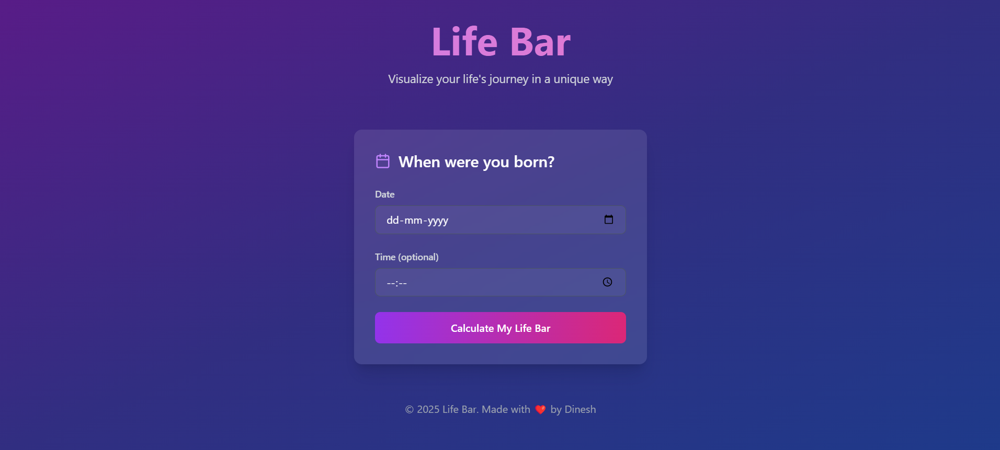

# ❤️ Life-Bar: Your Life's Journey Visualized

> 🚀 **Live Demo**: [https://lifebar.netlify.app/](https://lifebar.netlify.app/)

## 🎯 What is Life-Bar?

Life-Bar is a fun and interactive web application that visualizes your life's journey in real-time! Simply enter your birthdate (or your friend's), and watch as we transform your life's duration into fascinating metrics, comparisons, and visualizations. From heartbeats to blinks, from breaths to steps - see your life's story unfold in numbers!

## ✨ Features

### 🎨 Beautiful UI & UX
- Modern, clean interface with smooth animations
- Dark/Light mode support
- Responsive design that works on all devices
- Intuitive navigation and user flow

### 📊 Life Metrics Visualization
- Real-time life duration tracking
- Fascinating time comparisons (e.g., "You've lived through X sunrises")
- Biological metrics (heartbeats, breaths, blinks)
- Interactive life progress bar
- Custom life milestones

### 🎮 Fun Elements
- Share your life stats with friends
- Compare life metrics with historical events
- Generate beautiful life pamphlets
- Real-time updates of your life journey

### 🔒 Privacy First
- No data storage required
- All calculations done in real-time
- No personal information saved

## 🛠️ Tech Stack

### Frontend
- ⚡ Vite
- ⚛️ React 18
- 📘 TypeScript
- 🎨 Tailwind CSS
- 📱 Radix UI
- 📊 Chart.js

### Backend
- 🚀 Express.js
- 📦 Node.js

## 🎨 Design & Theme

Our app features a modern, minimalist design with:
- Clean typography
- Smooth animations
- Intuitive color scheme
- Consistent spacing and layout
- Accessible color contrasts
- Responsive breakpoints

## 🎯 How We Achieved It

This project was built entirely using AI assistance through:
- 🤖 Bolt AI
- 🖱️ Cursor IDE
- Zero manual coding required!

The development process involved:
1. Detailed planning and architecture design
2. AI-assisted component development
3. Automated testing and quality assurance
4. Continuous deployment and updates

## 🚀 Future Features

We're constantly improving! Here's what's coming next:
- [ ] Social media sharing integration
- [ ] More life metrics and comparisons
- [ ] Historical events timeline
- [ ] Custom milestone creation
- [ ] Life expectancy predictions
- [ ] Fun life achievement badges
- [ ] Mobile app version

## ⚠️ Current Status

This is an MVP (Minimum Viable Product) version of Life-Bar. While it's fully functional, we're actively working on:
- Performance optimizations
- Additional metrics and comparisons
- Enhanced user experience
- Bug fixes and improvements

## 🎯 Use Cases

Life-Bar is perfect for:
- 🎂 Birthday celebrations
- 🎓 Graduation parties
- 🎉 Life milestone celebrations
- 📚 Educational purposes
- 🎮 Fun social gatherings
- 📊 Data visualization enthusiasts

## 🤝 Contributing

We welcome contributions! While this project was built with AI, we're open to:
- Bug reports
- Feature suggestions
- UI/UX improvements
- Documentation enhancements

## 📝 License

This project is licensed under the MIT License - see the LICENSE file for details.

---

  <h3>Built with ❤️ using Dinesh</h3>
  
No code written by humans - 100% AI-powered development!

